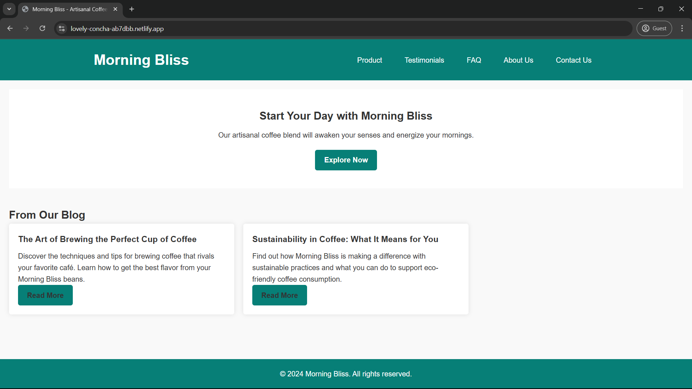
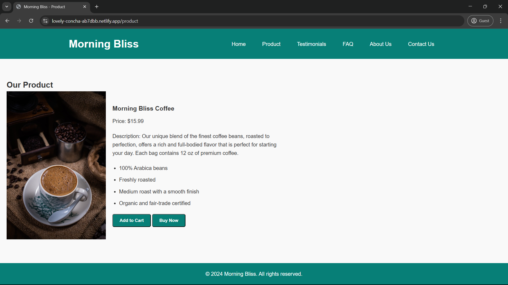
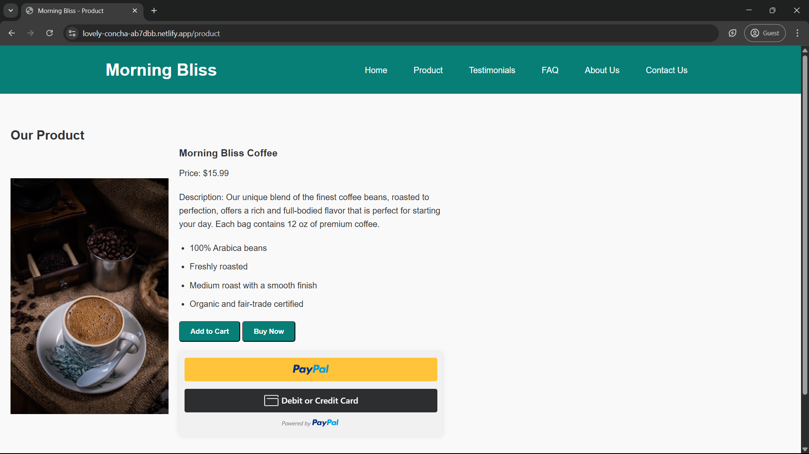
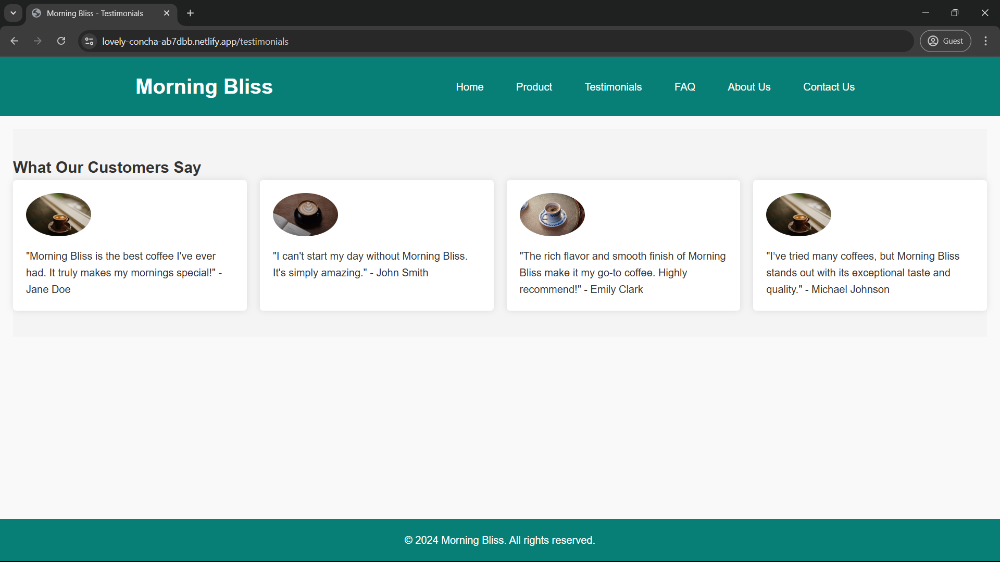
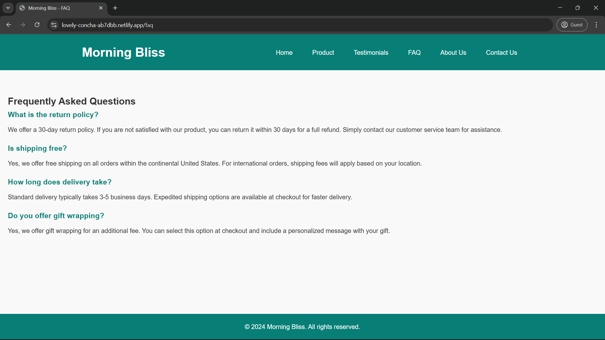
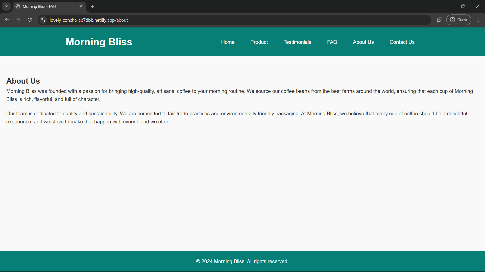
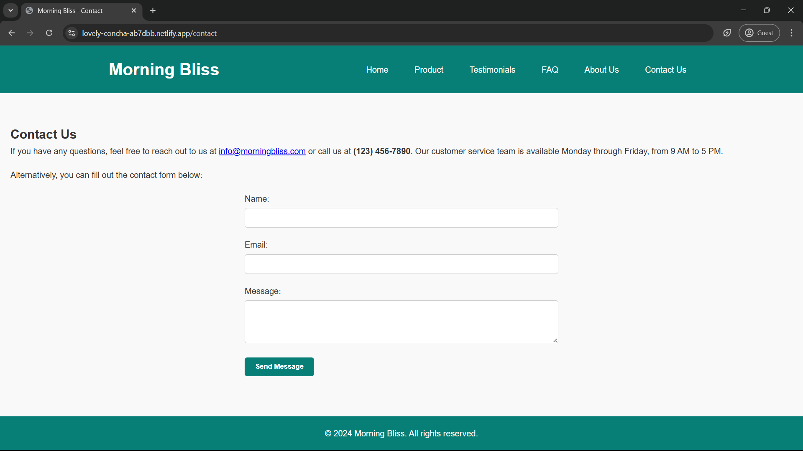

# ☕ Morning Bliss – Artisanal Coffee Blend

A simple, elegant website showcasing **Morning Bliss**, a premium artisanal coffee blend designed to kickstart your day with rich, full-bodied flavor. Built using HTML, CSS, and JavaScript.

🔗 **Live Demo**: [lovely-concha-ab7dbb.netlify.app](https://lovely-concha-ab7dbb.netlify.app)

---

## ✨ Features

* **Product Showcase**: Highlights the Morning Bliss coffee blend with detailed descriptions and pricing.
* **Customer Testimonials**: Displays real feedback from happy customers.
* **FAQ Section**: Answers to commonly asked questions about the product and service.
* **Contact Form**: Allows users to get in touch with the brand for support or inquiries.
* **PayPal Integration**: “Buy Now” button dynamically reveals a PayPal checkout for easy payments.

---

## 📁 Project Structure

```
/project-root
├── index.html            # Main landing page
├── style.css             # Styling for the website
├── script.js             # JavaScript functionality (e.g., PayPal button toggle)
├── /images/              # Images and icons (if any)
├── about.html            # About page
├── contact.html          # Contact page
├── faq.html              # FAQ page
├── product.html          # Product details page
├── testimonials.html     # Testimonials page
└── README.md             # Project documentation
```

---

## 🛠️ Getting Started

### Prerequisites

* A modern web browser (Chrome, Firefox, Safari, etc.)

### Installation

```bash
git clone https://github.com/Omashree/morning-bliss.git
cd morning-bliss
```

Open the website locally:

* On macOS: `open index.html`
* On Windows: `start index.html`
* On Linux: `xdg-open index.html`

---

## 💡 Usage

* **Homepage**: Introduction to Morning Bliss coffee.
* **Product Details**: Pricing, features, and highlights.
* **Testimonials**: Real customer experiences.
* **FAQ**: Quick answers to common questions.
* **Contact**: Simple way to get in touch.

### 🛒 PayPal Buy Now Button

* Click the “Buy Now” button to reveal the PayPal payment option.
* Complete your purchase through PayPal’s secure checkout process.

---

## 🤝 Contributing

Contributions are welcome! Here's how you can help:

1. Fork the repository
2. Create a new branch for your changes
3. Commit and push your changes
4. Open a pull request

---

## 📸 Screenshots















---

## 📄 License

This project is open-source and licensed under the **MIT License**.
